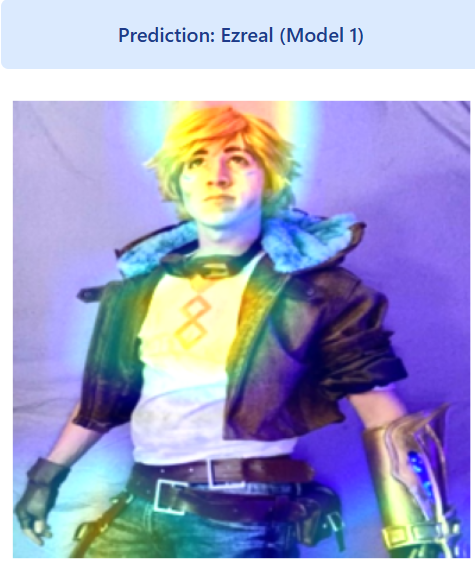
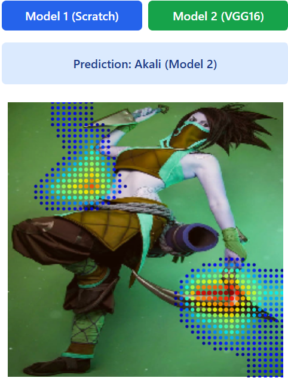

# League Champion Image Guesser

This project consists of two main parts: a deep learning model for guessing which League of Legends champion, character, a user's uploaded photo resembles, and a Flask web application to interact with these models.

## Project Overview

The core idea is to provide a fun and engaging experience where users can upload their photo and see which League of Legends champion the model predicts they look most like. This involves:

1.  **Model Creation:**
    * **"From Scratch" Champion Guesser:** A custom-built convolutional neural network (CNN) designed to take an image as input and output a prediction of the most similar League of Legends champion. This model was developed from the ground up, focusing on understanding the underlying principles of image classification.
    * **EfficientNet Extension:** An additional model that leverages the powerful EfficientNet architecture, a pre-trained deep learning model known for its efficiency and accuracy in image recognition tasks. This model serves as an extension, potentially offering improved performance or different insights compared to the "from scratch" model.

2.  **Flask Web Application:**
    * A lightweight web application built with Flask, allowing users to easily upload their images.
    * The app integrates with both trained models, enabling users to get predictions from either the "from scratch" model or the EfficientNet-based model.
    * The user interface provides a simple way to upload images and displays the predicted champion.

## Getting Started

These instructions will get you a copy of the project up and running on your local machine for development and testing purposes.

### Prerequisites

What you need to install the software:

* Python 3.x
* pip (Python package installer)

### Installation

1.  **Clone the repository:**

    ```bash
    git clone https://github.com/PeterDragoulev/What-Champion-Are-You.git
    cd What-Champion-Are-You
    ```

2.  **Create and activate a virtual environment (recommended):**

    ```bash
    python -m venv venv
    # On Windows
    .\venv\Scripts\activate
    # On macOS/Linux
    source venv/bin/activate
    ```

3.  **Install the required Python packages:**

    ```bash
    pip install -r requirements.txt
    ```

### Running the Application

1.  **Ensure your virtual environment is active.**

2.  **Run the Flask application:**

    ```bash
    python app.py
    ```
3.  **Open your web browser** and navigate to `http://127.0.0.1:5000/` (or the address displayed in your terminal).

## Project Structure

```
.
├── models/
│   ├── from_scratch_model.h5       # Saved model for the "from scratch" champion guesser
│   └── efficientnet_model.h5       # Saved model for the EfficientNet extension
├── static/
│   └── images/                     # Folder for uploaded images (if applicable)
│   └── css/                        # CSS files for styling the web app
│   └── js/                         # JavaScript files for the web app
├── templates/
│   └── index.html                  # Main HTML template for the web app
│   └── result.html                 # Template for displaying prediction results
├── data/                           # (Optional) Directory for raw/processed image data
│   └── champion_dataset/
├── app.py                          # Flask application main file
├── model_creation/                 # Directory for model training scripts and notebooks
│   ├── create_from_scratch_model.ipynb
│   └── train_efficientnet_model.py
├── requirements.txt                # List of Python dependencies
└── README.md                       # This file
```

## Model Creation Details

### "From Scratch" Champion Guesser

This model was built using TensorFlow and trained on a dataset of League of Legends champion images, consisting largely of splash arts, fan art, and other drawings for the different champions. It utilizes a custom CNN architecture consisting of Convolutional Layers, Pooling Layers, Normalization Layers, and dropout layers. To avoid the model from memorizing training images, as we had a very limited quantity of total images which could be used, we employed a few techniques, the first of which was rotating images by 0-10 degrees each time an image was processed, as well as the aforementioned dropout layers. In addition, we used K-fold cross-validation training for our final model iteration to confirm our model was generalizing and not memorizing specific data, and that human intervention had not caused inadvertent fitting to our validation data. The final model was trained on 200 epochs, as part of a 5-fold batch, which each ran 200 epochs. This resulted in the model guessing around 60% of validation tests correctly, well above the baseline of 10% if random guessing was used, as we had around 100 images for each character.

### EfficientNet Extension

This model leverages the pre-trained EfficientNetB0 architecture. The EfficientNet model was fine-tuned on the League of Legends champion image dataset. Transfer learning techniques were employed, where the pre-trained convolutional base was frozen and new classification layers were added and trained on our specific task. Overall, this model far surpassed the home-grown model we made, as could be expected with our data offering limited ability for data abstraction.

## Limitations

This model is meant to be used for fun to see what League of Legends champion you look like; however, the discrepancy between training data, cartoon drawings of champions, and use data, pictures of humans, means a lot of what was learned will not be useful for its predictions. However, testing with images of cosplayers, we were able to get decent results, with our heat maps showing the model had learned key features of game characters, though some will be shown below, some will not be useful for judging normal people.

First, an example showing good abstraction;
(Clarification Model 1 refers to our model, while Model 2 is exteneded EfficientNetB0)



As is seen above, the main area highlighted is the short blond hair of Ezreal, which is a feature that can be commonly expressed among regular non-cosplay pictures of people.

Next, a feature which is very well defined, but will not be useful in most cases;



## Contributing

Contributions are welcome! If you have suggestions for improvements or new features, please open an issue or submit a pull request.

## License

This project is licensed under the MIT License - see the `LICENSE.md` file for details. (If you have a license file.)

## Acknowledgments

* [Mention any resources, libraries, or datasets that were particularly helpful.]
* Riot Games for creating League of Legends.
